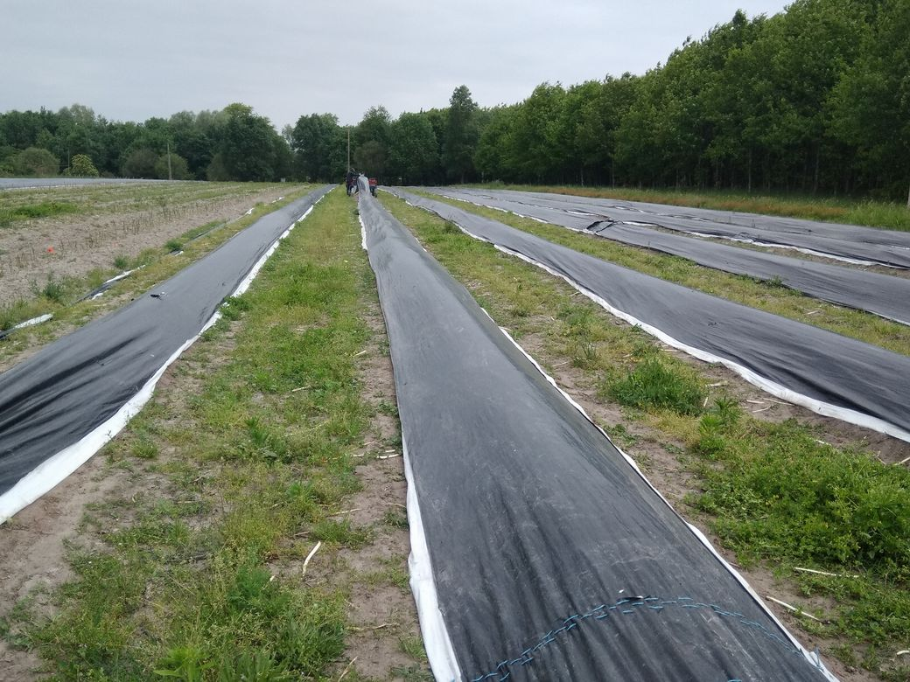

# Voilà c'est juste ça
Par un de ces temps variables qui déplaisent particulièrement aux paysans qui travaillent artisanalement le sol, se clôture une expérience faite de spiritualité, de ténacité et d'humilité.

Vers Saint-Gironde d'Aiguevives dans les languettes de sable de la Lande des Meuniers, 3,5 hectares de terres sont consacrées à la production en bio-dynamie d'asperges.

Au milieu d'un terroir disposant d'un Indication Géographique Protégée, un golfo, voyou ou futé suivant les interprétations, s'était mis en tête 10 ans plus tôt d'y faire pousser des asperges en s'inspirant des principes de la philisophie de la liberté de Rudolph Steiner.

Nous l'avions rencontré, 8 ans plus tôt, alors qu'il découvrait le terroir sur lequel il allait s'appliquer à prouver que malgré les intempéries, les criocères et l'incrédulité du voisinage, il était possible de faire pousser des asperges dans le respect de la charte de l'agriculture paysanne, sans intrants ni engrais chimiques, avec l'aide de la lune et de quelques incantations de pensée magique.
A cette époque il s'agissait de préparer cet espace, sis au milieu des vignes et des bois entre terres argileuses et sable fin, comme si les accidents géologiques avaient été plus nombreux ici qu'ailleurs dans ces abords d'alluvions de la Gironde proche.

Le premier chantier fut de contingenter la prolifération du chien-dent, plante adventrice dont les rhizomes tapissent le sol et empêchent la croissance des végétaux à proximité.
Ce lierre des champs ne pouvant être totalement éradiqué, son confinement nécessita 2 ans de labours. Ca tombait bien car la production d'asperges ne peut commencer qu'à partir de la troisième année de récolte.
A l'issue de ce travail préalable, la griffe d'asperges à partir de laquelle pousseront pendants plusieurs années les turions furent plantée, sûrement entre 2 cycles lunaires.
De tout les prédateurs connus, le criocère est le plus redouté des paysans. Ce coléoptère phytophage dépose ses larves qui affectent essentiellement la partie aérienne de la plante. C'est donc particulièrement préjudiciable aux asperges vertes qui poussent à l'air libre.

Pour celles qui poussent sous bâche le risque est moins important mais leur prolifération pendant la période de de croissance des feuilles peut être péjudiciables au développement de la griffe.
De l'avis général des producteurs locaux la seule solution consiste donc dans l'emploi d'insecticides pour éradiquer ce nuisible. Pour résister à cette tentation, Laurent a expérimenté plusieurs solutions d'insecticites naturels comme le souffre ou le sacrifice de rangs d'asperges moins produitives pour finir par s'apercevoir que la création d'un environnement propice au développement d'araignées permettait de contenir leur prolifération.

Le travail d'enrichissement de la terre s'est ensuite poursuivi par l'introduction d'apports nutritionnels comme la silice ou la bouse de corne en accord avec les principes de l'agriculture bio-dynamique. Appelée au départ agriculture spirituelle, ce mode de culture basé sur l'observations des éléments air, eau, feu et terre et des cycles de croissance des végétaux s'attache à dynamiser le vivant en le mettant en relation avec l'univers qui l'entoure.
Qualifiés de pratiques pseudo-scientifiques conférant à la pensée magique, la mise en oeuvre du calendrier des semis issue des travaux empiriques de Maria et Matthias Thun déchaîne les mêmes critiques que l'homéopathie et dans une moindre mesure la pédagogie Montessori. Mais chez Laurent, cette philosophie se résume en une phrase : "voilà, c'est juste ça". Juste comme l'attention prêtée à l'environnement, juste comme l'humilité devant les aléas et contraintes imposées par le contexte, juste enfin comme le geste sec et vigoureux, la gouge à la main pour extraire au sable, la précieuse asperge blanche.

Combinés aux éléments requis pour l'obtention d'une certification de production en agriculture biologique ces prescriptions n'en ont pas moins permis la rencontre entre le sol vivant et l'action vigoureuse d'un passionné, probablement agité par de nombreuses forces cosmiques.
Cette pensée magique contamine aujourd'hui jusqu'aux hôpitaux spécialisés dans le traitement des cancers intestinaux et aux cuisines des restaurants étoilés qui harcèlent Laurent pour qu'il continue sa production reconnue à la fois pour sa valeur gustative aussi bien que nutritive.

Pendant huit ans il a donc bravé les éléments imprévisibles de la courte saison de récolte des asperges pour fournir en circuit court un réseau d'amateurs et de consommateurs engagés. A l'aube, seul ou aidé d'un ou deux assitants, ils ont dégagé de la terre sableuse à l'aide de leur gouge les pointes blanches émergeant de la terre.

Pour mener à bien l'exploitation de ses 16 rangs de production, Laurent s'est dôté d'une aspergeSpin, machine munie de 2 batteries électriques permettant de soulever la bâche protégeant de la lumière et des prédateurs les asperges et de disposer dans les caisses les précieux turions au gré du geste maintes fois répétés à la griffe originelle.

Transportées ensuite avec la brouette ou la voiture, les caisses d'asperges fraichement cueillies sont nettoyées au jet d'eau pour enlever superficiellement le sable et la terre puis retirer les écailles qui "rouillent" les asperges et endommagent son apparence immaculée.

Les asperges sont ensuites nettoyées avec une machine qui utilise de l'eau du puit recyclée sur 2 ou 3 circuit de lavage en fonction de l'avancement de la saison et de l'augmentation de l'acidité. Au terme de cette toilette les asperges sont calibrées et mises au frais et à l'abri de la lumière dans la chambre froide.

Pendant ce rituel répété chaque jour pendant six à huit semaines, Laurent ajuste l'offre et la demande à l'aide d'un téléphone même pas forcément intelligent, à l'aide des 140 caractères qui suffisent à indiquer si c'est l'offre ou la demande qui l'emporte.

